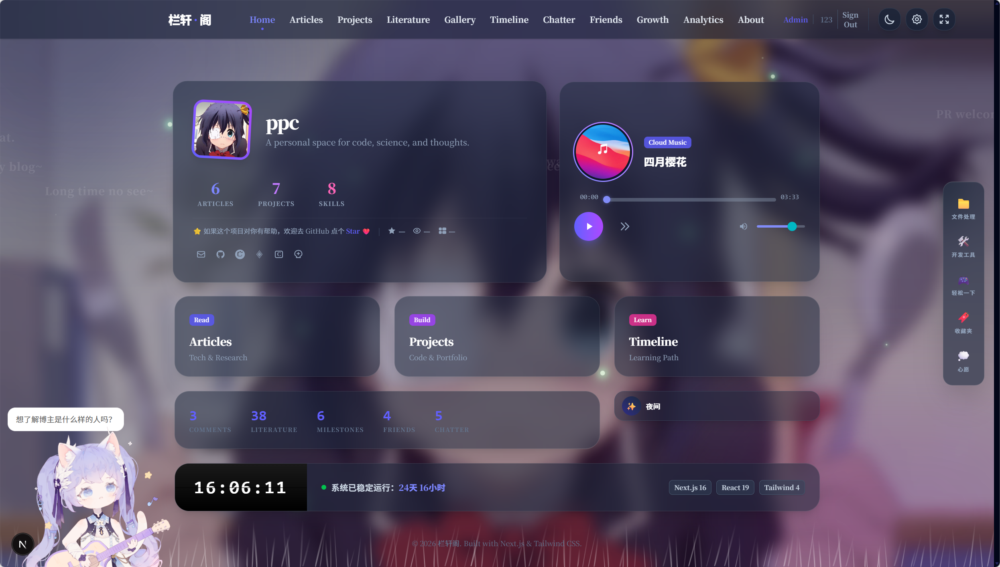
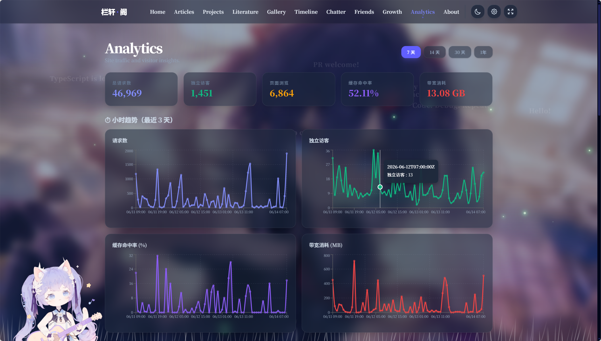
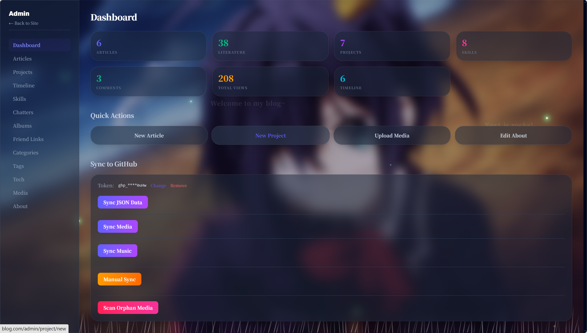
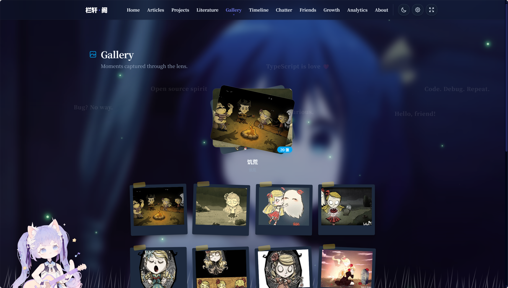

<div align="center">


**个人技术博客与作品集 — 全栈一体化博客系统**
[](https://github.com/pc-Blog/next/actions)
[](https://github.com/pc-Blog/next/releases)
[](LICENSE)
[](package.json)
[](package.json)
[](package.json)
[](package.json)
[](package.json)
[](https://github.com/pc-Blog/next/pulls)

**在线体验：[https://www.lxpavilion.top](https://www.lxpavilion.top)** ✨
**项目介绍：[https://www.lxpavilion.top/project/18/](https://www.lxpavilion.top/project/18/)**

</div>


---

> 一个集技术文章、项目展示、摄影图库、文学创作、在线小工具于一体的个人博客系统。前端基于 Next.js 16 App Router 构建，后端由 Spring Boot 3 驱动，支持 GitHub Pages 静态部署与 Docker 容器化运行，配备完整的管理后台与 GitHub 数据同步流水线。

---

## ✨ 特性

- **📝 全功能内容管理** — 文章（Markdown / 目录 / 分类 / 标签）、项目展示、摄影图库（瀑布流 + Lightbox）、文学创作、说说动态、友情链接、学习时间线
- **🛠️ 管理后台** — `/admin` 完整 CRUD、Markdown 编辑器（支持图片上传）、分类/标签管理、GitHub 数据同步、孤立媒体清理、SEO 配置
- **🎨 丰富的交互体验** — Live2D 看板娘（双模型）、动态背景轮播、粒子特效（萤火虫/樱花/动态草地）、弹幕背景、点击涟漪效果、音乐播放器、明暗双主题
- **📊 站点分析与多平台统计** — Cloudflare Workers 驱动的流量分析（PV/UV/缓存命中率/国家分布等）+ 跨平台聚合统计（CSDN / 掘金 / 博客园文章数据）
- **🔍 SEO 优先** — JSON-LD 结构化数据（WebSite / Article / Person / BreadcrumbList）、Open Graph / Twitter Card、动态 Sitemap、RSS Feed、集中式 SEO 配置
- **🚀 双模式部署** — Docker 容器化（standalone 模式）& GitHub Pages 静态导出（CI/CD 自动构建），数据从后端同步到 `data` 分支触发静态构建
- **🎮 内置小工具** — 2048、贪吃蛇、俄罗斯方块、五子棋、扫雷、图片拼图、二维码生成、密码生成、进制转换、JSON 格式化、文件加密、许愿墙
- **📱 响应式设计** — 完整的移动端适配，玻璃拟态（Glassmorphism）设计语言，优雅的 Framer Motion 动画过渡

---

## 📸 演示

| 页面 | 说明 |
|------|------|
| **首页** | 个人信息面板、音乐播放器、站点仪表盘、GitHub 仓库统计 |
| **文章列表/详情** | 分类筛选、标签云、Markdown 渲染、TOC 目录导航、Giscus 评论 |
| **项目展示** | 按分类/技术栈筛选 |
| **图库** | 瀑布流相册、Lightbox 图片预览 |
| **管理后台** | 内容发布、媒体管理、数据同步控制台 |
| **站点统计** | 请求量趋势图、访客画像、缓存分析、多平台文章数据聚合 |






---

## 🚀 快速开始

### 前置要求

- **Node.js** >= 18（推荐 22，Docker 镜像基于 Node 22）
- **npm** 或 **pnpm**
- （可选）后端服务：请搭配 [pc-Blog/springBoot](https://github.com/pc-Blog/springBoot) 使用

### 安装与运行

```bash
# 克隆仓库
git clone https://github.com/pc-Blog/next.git
cd next

# 安装依赖
npm install

# 启动开发服务器（Turbopack）
npm run dev          # 访问 http://localhost:3000
```

### 生产构建

```bash
# Docker 模式（standalone 输出）
npm run build

# 静态导出（GitHub Pages）
npm run build:static    # 产物输出到 out/
```

### 关键配置

所有核心配置集中在 [`lib/siteConfig.ts`](lib/siteConfig.ts) 中：

| 配置项 | 说明 | 必填 |
|--------|------|------|
| `title` / `authorName` / `bio` | 站点标题、作者名、简介 | ✅ |
| `blog` / `hasDomain` | 站点域名（是否有自定义域名） | ✅ |
| `repo` / `repoId` | GitHub 仓库名和 ID | ✅ |
| `backUrl` | Java 后端 API 地址 | ✅ |
| `analytics` | Cloudflare Analytics Worker 域名 | ❌ |
| `giscusCategory` / `giscusCategoryId` | Giscus 评论区分类 | ❌ |
| 社交链接 | GitHub / Gitee / 掘金 / CSDN / 博客园 | ❌ |

> Cloudflare Worker 配置在 [`workers/wrangler.json`](workers/wrangler.json) 中，包括路由域名、Zone ID 和平台账号 ID。

---

## 📖 使用指南

### 创建文章

在管理后台（`/admin`）中登录后：

1. 进入 **文章管理** → **新建文章**
2. 使用 Markdown 编辑器撰写内容，支持图片上传（自动上传到后端 MinIO）
3. 选择分类和标签，设置是否置顶/发布
4. 保存后即可在前台文章列表查看

### 数据同步（GitHub Pages 静态部署）

后台提供一键数据同步功能，将后端数据同步到 GitHub `data` 分支：

1. 在后台 **数据同步** 页面输入 GitHub Token（需 `repo` 权限）
2. 分别触发 **JSON 同步**、**媒体同步**、**音乐同步**
3. 推送 `master` 或 `data` 分支后，GitHub Actions 自动构建并部署

### 常用命令

```bash
npm run dev             # 启动开发服务器（Turbopack）
npm run build           # 生产构建（standalone 输出，用于 Docker）
npm run build:static    # 静态导出（用于 GitHub Pages）
npm run start           # 启动生产服务器
npm run lint            # ESLint 代码检查
```

### 自定义主题

设计规范文档见 [`docs/STYLE-GUIDE.md`](docs/STYLE-GUIDE.md)，包含：

- 玻璃拟态（Glassmorphism）卡片规范
- 亮色 / 暗色双主题配色 Token
- Tailwind CSS 样式层级
- Framer Motion 动画参数
- 响应式断点与布局规则

---

## 📁 项目结构

```
next/
├── app/                              # Next.js App Router 路由页面
│   ├── (main)/                       # 主路由组（共享布局）
│   │   ├── about/                    # 关于页
│   │   ├── analytics/                # 站点统计
│   │   ├── article/[id]/             # 文章列表 + 详情
│   │   ├── auth/                     # 登录/注册
│   │   ├── chatter/                  # 说说动态
│   │   ├── friends/                  # 友链墙
│   │   ├── gallery/                  # 摄影图库
│   │   ├── growth/                   # 博客成长记录
│   │   ├── literature/[id]/          # 文学创作
│   │   ├── project/[id]/             # 项目展示
│   │   ├── timeline/                 # 学习历程
│   │   ├── tools/                    # 在线小工具（12 个）
│   │   │   ├── 2048/                 # 2048 游戏
│   │   │   ├── snake/                # 贪吃蛇
│   │   │   ├── tetris/               # 俄罗斯方块
│   │   │   ├── gomoku/               # 五子棋
│   │   │   ├── minesweeper/          # 扫雷
│   │   │   ├── image-puzzle/         # 图片拼图
│   │   │   ├── image/                # 图片处理
│   │   │   ├── qrcode/               # 二维码生成
│   │   │   ├── password/             # 密码生成
│   │   │   ├── base-convert/         # 进制转换
│   │   │   ├── json-formatter/       # JSON 格式化
│   │   │   ├── file-encrypt/         # 文件加密
│   │   │   └── wishes/               # 许愿墙
│   │   ├── layout.tsx                # 主布局（Header + Main + Footer）
│   │   ├── page.tsx                  # 首页
│   │   └── template.tsx              # 页面模板
│   ├── admin/                        # 管理后台路由组
│   │   ├── article/                  # 文章 CRUD
│   │   ├── project/                  # 项目 CRUD
│   │   ├── album/                    # 相册 CRUD
│   │   ├── chatter/                  # 说说管理
│   │   └── ...                       # 分类/标签/媒体/技能/友链/时间线管理
│   ├── _components/                  # 共享组件
│   │   ├── admin/                    # 管理后台组件（MarkdownEditor、DatePicker 等）
│   │   ├── article/                  # 文章组件（ArticleCard、TOC、导航等）
│   │   ├── auth/                     # GitHub 登录按钮
│   │   ├── comment/                  # Giscus + 评论表单
│   │   ├── common/                   # 通用组件（搜索栏、分页、设置面板等）
│   │   ├── effects/                  # 视觉效果（萤火虫、樱花、草地）
│   │   └── layout/                   # 布局组件（Header、Footer、FloatingNav、MusicPlayer 等）
│   ├── layout.tsx                    # 根布局（字体、主题、背景特效、Live2D）
│   ├── sitemap.ts                    # 动态站点地图
│   └── feed.xml/route.ts             # RSS Feed
├── lib/                              # 核心工具与 API
│   ├── api/                          # 后端 API 客户端
│   ├── types/index.ts                # TypeScript 类型定义
│   ├── siteConfig.ts                 # 站点配置中心
│   ├── config.ts                     # 运行时动态配置合并
│   ├── seo.ts                        # SEO/JSON-LD 配置生成器
│   ├── analytics.ts                  # Cloudflare 分析客户端
│   ├── github-sync.ts                # GitHub 数据同步引擎
│   ├── static-data.ts                # 静态数据层（GH Pages 模式）
│   ├── axios.ts                      # Axios 实例（含认证拦截器）
│   ├── useAudioPlayer.ts             # 音乐播放器 Hook
│   ├── growth.ts                     # GitHub Commit 历史获取
│   └── toast.ts                      # Toast 通知组件（纯 DOM 实现）
├── stores/                           # Zustand 全局状态
│   ├── authStore.ts                  # 认证状态
│   ├── musicStore.ts                 # 音乐播放器状态
│   └── settingsStore.ts             # 用户设置
├── workers/                          # Cloudflare Workers
│   ├── cf-analytics-worker.js        # 流量分析代理 + 多平台统计
│   └── wrangler.json                 # Worker 配置
├── public/                           # 静态资源
│   ├── bg/                           # 背景轮播图（10 张）
│   ├── fonts/                        # 本地字体（Geist、Geist Mono、Noto Serif SC）
│   ├── live2d-models/                # Live2D 模型（Ava、Diana）
│   ├── pio/                          # Pio Live2D SDK 框架
│   └── seo/                          # OG 图片
├── docs/                             # 项目文档
│   ├── ARCHITECTURE.md               # 架构说明
│   ├── STYLE-GUIDE.md                # 设计规范
│   └── GIT.md                        # Git 工作流
├── .github/workflows/deploy.yml      # GitHub Actions 部署流水线
├── Dockerfile                        # 多阶段 Docker 构建
├── next.config.ts                    # Next.js 配置
├── package.json                      # 依赖与脚本
├── tsconfig.json                     # TypeScript 配置
└── eslint.config.mjs                 # ESLint 配置
```

---

## 🚢 部署

### Docker 部署

```bash
# 构建镜像
docker build -t blog-next .

# 运行容器
docker run -d \
  --name blog-next \
  -p 3000:3000 \
  blog-next
```

构建产物使用 Next.js 的 `standalone` 模式，镜像基于 `node:22-alpine`，体积小、启动快。后端地址通过 `lib/siteConfig.ts` 中的 `backUrl` 配置。

### GitHub Pages 静态部署

```bash
# 本地构建
npm run build:static    # 产物输出到 out/
```

**CI/CD 自动化部署**（[`.github/workflows/deploy.yml`](.github/workflows/deploy.yml)）：

1. 推送 `master` 或 `data` 分支触发 Actions
2. Actions 检出源代码 + `data` 分支的静态数据
3. 将数据文件复制到 `public/data/` 目录
4. 执行 `npm run build:static`（环境变量 `NEXT_PUBLIC_IS_STATIC=true`）
5. 根据 `siteConfig.hasDomain` 自动生成 CNAME 文件
6. 通过 `peaceiris/actions-gh-pages` 推送到 `gh-pages` 分支

**数据同步流水线：**

```
后端 API  →  数据同步脚本（GitHub Token）  →  data 分支（JSON + 媒体 + 音乐）
                                                                  ↓
用户访问  ←  GitHub Pages  ←  gh-pages 分支  ←  CI 构建（build:static）
```

---

## 🤝 贡献

欢迎提交 Issue 和 Pull Request！

1. Fork 本仓库
2. 创建功能分支：`git checkout -b feat/amazing-feature`
3. 提交变更：`git commit -m 'feat: add amazing feature'`
4. 推送分支：`git push origin feat/amazing-feature`
5. 提交 Pull Request

请遵循项目已有的代码风格（见 [`docs/STYLE-GUIDE.md`](docs/STYLE-GUIDE.md)）和 Git 提交规范（见 [`docs/GIT.md`](docs/GIT.md)）。

### Fork 部署自己的站点

修改以下文件即可移植到自己的环境：

| 文件 | 改动内容 |
|------|---------|
| [`lib/siteConfig.ts`](lib/siteConfig.ts) | 域名、仓库名、作者信息、后端地址、社交链接、Giscus 配置 |
| [`workers/wrangler.json`](workers/wrangler.json) | Worker 路由域名、Zone ID、平台账号 ID |

Giscus 评论需在新仓库 Settings 中开启 Discussions，然后到 [giscus.app](https://giscus.app) 获取 `categoryId` 填入 `siteConfig.ts`。

#### Cloudflare 配置说明

项目使用 Cloudflare 提供两项服务：

**1. 流量分析 API（cf-analytics-worker）**

`workers/cf-analytics-worker.js` 是一个 Cloudflare Workers，用于代理 Cloudflare GraphQL Analytics API 并聚合多平台统计（CSDN / 掘金 / 博客园）。

部署步骤：

```bash
# 安装 Wrangler CLI
npm install -g wrangler

# 登录 Cloudflare 账号
wrangler login

# 部署 Worker
cd workers
wrangler deploy
```

**环境变量（需配置 Secrets）：**

| 变量 | 说明 | 必填 |
|------|------|------|
| `CF_API_TOKEN` | Cloudflare API Token（需 `Analytics:Read` 权限，在Cloudflare 面板设置） | ✅ |
| `CF_ZONE_ID` | Cloudflare 区域 ID | ✅ |
| `CSDN_USER` | CSDN 用户名（用于 `/platform` 多平台统计） | ❌ |
| `JUEJIN_USER_ID` | 掘金用户 ID | ❌ |
| `CNBLOGS_BLOGAPP` | 博客园 blogApp | ❌ |

**配置路由：** 修改 `workers/wrangler.json` 中的 `routes` 字段，将 `analytics.lxpavilion.top` 替换为你的域名。Worker 配置了 `custom_domain: true`，也可在 Cloudflare 面板绑定自定义域。

**2. CDN / 缓存加速**

如果站点域名托管在 Cloudflare，所有静态资源会自动获得 CDN 加速和缓存。首页的背景轮播图、字体文件、Live2D 模型等大资源建议通过 Cloudflare 控制台的 **Caching → Cache Rules** 配置较长的缓存时间。

---

## 📄 许可证

本项目基于 [MIT License](LICENSE) 开源。

---

## 💡 致谢

### 参考与灵感

感谢以下博主的开源分享，本项目的设计和实现参考了他们的优秀作品：

- **[XingHuiSamaの宝藏之地](https://www.xinghuisama.top)** — 项目主体样式布局和整体功能的主要参考来源
- **[流欺不欺](https://blog.lqay.cn/)** — 部分功能与样式参考
- **[Starhiroの小站](https://boke.hiromu.top/)** — 部分功能与样式参考

### 技术依赖

- [Next.js](https://nextjs.org/) — React 全栈框架
- [Tailwind CSS](https://tailwindcss.com/) — 原子化 CSS
- [Framer Motion](https://www.framer.com/motion/) — 动画引擎
- [Giscus](https://giscus.app/) — 基于 GitHub Discussions 的评论系统
- [Lucide](https://lucide.dev/) — 开源图标库
- [Recharts](https://recharts.org/) — 图表库
- [Zustand](https://github.com/pmndrs/zustand) — 状态管理
- [Pio Live2D](https://github.com/dsrkafuu/live2d-widget) — Live2D 看板娘框架
- 后端支持：[pc-Blog/springBoot](https://github.com/pc-Blog/springBoot)

---

<div align="center">
  <sub>Built with ❤️ by <a href="https://github.com/PC2005-cloud">ppc</a></sub>
</div>
